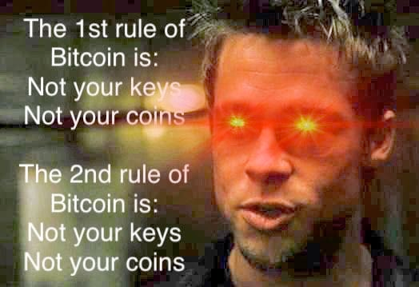
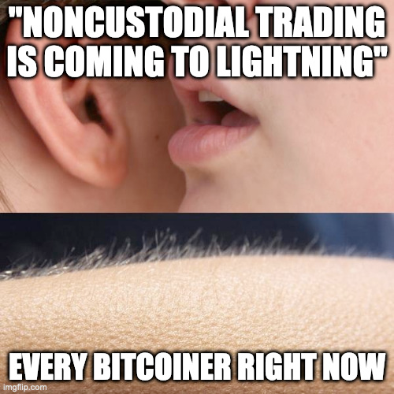
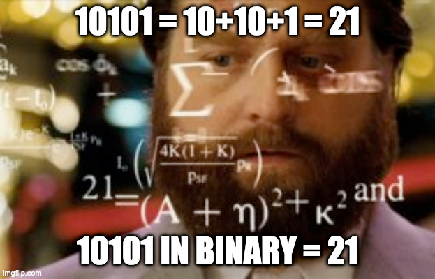

# Sex is great, but have you tried noncustodial finance?

Now that we have your attention, let us recap the two rules in Bitcoin:

That is it, it is that dead simple: if you keep your Bitcoin on an exchange instead of putting them into self custody, you are going to have a bad time.
Remember MtGox?

> "That's too long ago, exchanges got better", John Doe, holds his Bitcoin on FTX.

John, we are sorry to tell you: "Not your keys, not your coins!".
Did you learn your lesson?

> "But, but, I wanted to trade!", John Doe

That is a common response we get, and we hear you!

This is why we are bringing noncustodial peer-to-peer financial products to Lightning.

## The Vision

Imagine a world just days before [hyperbitcoinization](https://bitcoinmagazine.com/hyperbitcoinization) finally hits.
You walk along the beach enjoying the warmth of the sunset.

You stop at a small food truck selling you a juicy steak, medium rare without sides, just perfect.
You tap with your phone to pay with Lightning and sit down to enjoy the orange light of the sunset.

Someone sells you a Tequila Sunrise - ahm - Tequila Sunset, freshly prepared right in front of you.

While you take a sip from the drink, you read the latest news of the fed raising interest rates while throwing on the money printer at the same time to fight inflation.
You casually take out your phone and open a long position on Bitcoin, knowing, that the last actions of the government will push the price even higher.

Relaxed you lay back and open a streaming service which charges per seconds paid via Lightning.
You wanted to check in on your favorite team, El Salvadore, who very likely will become world champion this year.
Watching the team in orange shirts pushes your adrenaline higher and makes you euphoric.
You bet that El Salvadore will win and are happy to put a few Sats on that.

An entertaining game later, you stack the profits of your bet and wander home.

At home, you move the Sats from today's winnings into the noncustodial savings account which eventually will pay for your son's tuition.
You check in on your long position seeing it is going well and double down once more before going to bed.

Knowing all you did today was secured by Bitcoin, fully noncustodial and without having to trust anyone, you fall asleep with a smile on your face.

Sounds to good to be true? Let us introduce you **10101 the One-Stop Bitcoin Wallet for the sovereign Bitcoiner**.

## 10101

10101 is a **noncustodial** on-chain and Lightning **wallet** for the masses.
It has all the bells and whistles a good Bitcoin wallet needs with an extra level of pizazz.

1. You can pay **on-chain** or **off-chain** to anyone on the Lightning Network, and you can receive on-chain payments or payments from anyone on the Lightning Network.
2. It will allow you to **trade** CFDs, Options and other derivatives secured by Bitcoin.
3. You can **bet** on who becomes the world champion at Fifa22, and
4. open a **savings account** secured by Bitcoin.

We are doing all this while applying the 2 rules of Bitcoin:

### Rule 1: Your keys, your coins

The wallet in 10101 is fully noncustodial.
This means, you have the power and the responsibility to manage your own funds.
This is valid for your on-chain wallet as well as your Lightning wallet.

### Rule 2: Your keys, your coins

For trading or betting we follow the same rules: at no point in time you will have to trust the counterparty of your trade with your funds.
To achieve this we are making use of DLCs (Discreet Log Contracts).
DLCs are the Bitcoin-way of bringing smart contracts on-chain: It is a contract protocol where two parties agree to exchange money dependent on the outcome of a certain event as determined by an oracle (or several oracles). After the event happens, the oracle publishes a commitment to the outcome of the event that the winning party can use to claim their funds. The oracle does not need to know the terms of the contract (or even that a contract was made in the first place).

## The team

We are not a random group of devs who came together trying to reform the financial system and the world of betting.
Wait, we are. But, we have proven that we can do it!

Over the last year have been building [ItchySats](https://itchysats.network/), a solution which enables you to trade CFDs peer-to-peer without having to trust your counterparty while you keep full custody over your coins at all times.

Before that we have built atomic swaps solution and enabled users to [swap Bitcoin to Monero atomically](https://github.com/comit-network/xmr-btc-swap).

Now, we are doubling down, and are bringing noncustodial financial services to Lightning.
