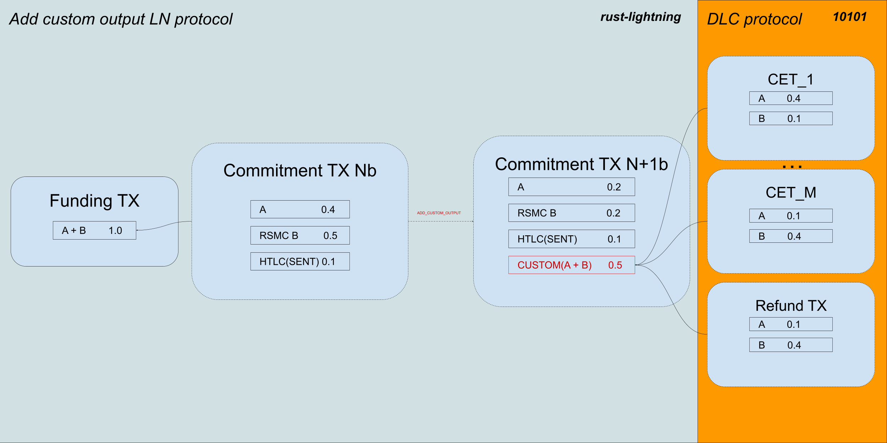
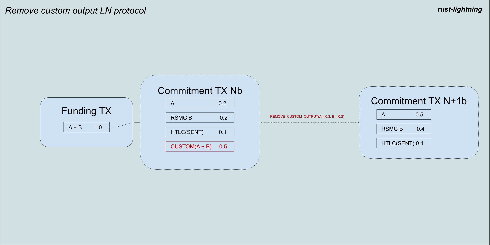

In this post we will explain how we are using Bitcoin and Lightning to build 10101, our non-custodial mobile wallet.
Our vision for 10101 does not stop at providing near-instant Bitcoin payments on your phone.
We are building a platform that will let you _use_ your favourite digital currency.
On 10101 we will provide **derivatives trading** for the risk-tolerant investor; **sports betting** for the die-hard fan; and **Bitcoin savings accounts** for all you satoshi stackers out there.

Since we only started building 10101 a few weeks ago, we had to define a realistic but ambitious scope for our [Legends of Lightning](https://makers.bolt.fun/project/10101) [project](https://makers.bolt.fun/project/10101).
My teammate [holzeis](https://makers.bolt.fun/profile/408/holzeis) already shed some light on what that means for the UX and frontend in [his post on user journeys](https://makers.bolt.fun/story/your-lightning-powered-journey-to-non-custodial-cfd-trading--268).
And I will now address what we are doing in the guts of the application.

## Expanding the capabilities of Lightning

You already know that Lightning's killer feature is the ability to make quick payments using Bitcoin.
Instead of having to wait for a transaction to be mined every time coins are transferred, Lightning nodes collaborate to build off-chain state which is unilaterally enforceable by all parties involved.
After a series of Lightning payments between two parties, either one can effectively cash out and move the state on-chain.

Payments are a basic building block of any wallet, but 10101 wants to do more.
For the tournament, we want to offer [Contract for Difference](https://www.investopedia.com/terms/c/contractfordifferences.asp) (CFD) trading _on Lightning_.

You may have heard of [ItchySats](https://www.itchysats.network/), a product of ours which already offers trustless CFD trading on RPi and desktop.
For ItchySats, we chose to use [our custom implementation](https://github.com/comit-network/maia/) of [_Generalized Bitcoin-Compatible Channels_](https://eprint.iacr.org/2020/476.pdf) to allow the CFD to be perpetual.
The CFD is represented by a [Discreet Log Contract](https://bitcoinops.org/en/topics/discreet-log-contracts/) (DLC) which is periodically rolled over to keep the contract alive.

Since 10101 will be built on top of Lightning, it is only natural that we would now use Lightning channels to host the CFDs.
In the name of #BuildInPublic, we documented our thought process behind this design decision [here](https://github.com/itchysats/10101/issues/8#issuecomment-1284973135).
We considered [other alternatives](https://github.com/itchysats/10101/issues/8#issue-1411563111) which also involved Lightning in different ways, but we settled on something that will see us building a full-fledged Lightning node that also supports DLCs.

## DLCs on Lightning

We are not the first people to propose [adding DLC support to Lightning](https://hackmd.io/@lpQxZaCeTG6OJZI3awxQPQ/LN-DLC).
The fantastic [dlcspecs](https://github.com/discreetlogcontracts/dlcspecs) project has generated [conversations](https://github.com/discreetlogcontracts/dlcspecs/issues/3) around this topic over the last few years.
There have even been [attempts](https://github.com/lightningdevkit/rust-lightning/pull/619) at adding DLC support to working implementations of Lightning.
That is to say that what we are building today is only possible thanks to the excellent work of the Bitcoin dev community.

As previously mentioned, our approach will be to integrate DLCs directly into the Lightning channel.
We were blessed to find a production-ready Bitcoin Lightning library written in Rust: [`rust-lightning`](https://github.com/lightningdevkit/rust-lightning).
We saw this library as an excellent fit because it is written in our preferred language and it has already been used to build Lightning wallets for mobile.
With all this in mind, our plan involves extending `rust-lightning` to support DLCs.

### Adding _custom outputs_ to a commitment transaction

Because the DLC protocol involves a few things that are completely orthogonal to Lightning (interacting with an oracle, generating many CETs), we decided to reframe the goal from "adding DLCs to Lightning" to "adding _custom outputs_ to Lightning".
The motivation here is to be able to minimise the changes that we need to make to `rust-lightning`.
Effectively, the library will not need to understand the DLC protocol.
It will just need to support the creation of outputs with _arbitrary scripts_.

By default, a Lightning commitment transaction can contain:

- Simple outputs that pay directly to Alice or Bob.
- Revocable outputs that pay to Alice or Bob after a timelock expires.
- Revocable HTLCs to route payments.

This means that a Lightning commitment transaction expects its outputs to be of a particular kind.
With our extensions, the commitment transaction is able to host a new kind of _revocable_ output with arbitrary spend conditions.
In our current design, the arbitrary spend conditions are external to the library and Lightning is oblivious to them; but the output will be revocable using the same mechanism and keys that are used for the other outputs in the transaction.

Contrary to the other types of output, the coins that make up the new custom output can come from _both_ parties.
This is a necessary requirement for DLCs and other interesting protocols, where both parties lock up coins in a shared output.

The 10101 wallet application will therefore have to handle all the DLC-specific transaction building and signing, using the shared custom output as the DLC.

### Settling your CFD into the Lightning channel

One huge advantage of the 10101 approach to CFD trading versus what we previously built with ItchySats is that the CFD can be settled directly back into a Lightning channel!
This means that the off-chain state doesn't have to be committed on-chain and that the coins are readily available to make payments or do whatever else 10101 lets you do in the future.

This protocol is analogous to how a HTLC would be removed from a commitment transaction after a payment is claimed.
Except for the fact that the coins in the custom output can be _split up_ between the two parties.

### Force-closing a channel containing a custom output

The only thing that is special about force-closing a channel that contains a custom output is the way in which the custom output is spent.
Whilst all the regular Lightning outputs will eventually make their way to either Alice's Bitcoin wallet or Bob's Bitcoin wallet, the custom output is treated differently.

Since `rust-lightning` will not know how to spend this custom output, it will be the responsibility of the application built on top of `rust-lightning` to do so.
For a 10101 wallet trading CFDs, the custom output will be a DLC very similar to the one described in this [blog post](https://comit.network/blog/2022/01/11/cfd-protocol-explained/).

## Compatibility with other Lightning nodes

The point of building 10101 on Lightning is to become part of the Lightning Network.
We are excited to cater to its large and constantly growing userbase.
To this end, it is very important for us to build a Lightning wallet which is compatible with the rest of the network.

Our modifications to `rust-lightning` extends the capabilities of the 10101 Lightning node, without compromising its ability to route payments to and from any other node.
As such, the 10101 wallet will only be able to do CFD trading with compatible nodes, but it will let you pay for your coffee at your favourite cafe.

## Future work beyond the Legends of Lightning Tournament

Our goal for the tournament is to demonstrate that what we are building is possible and extremely cool.
Whilst we would love to ship flawless Lightning CFD trading to your phone in less than 2 months, we have decided to cut some corners in the interest of time.
Here are some things that we will address after the tournament:

- Polishing our `rust-lightning` [fork](https://github.com/itchysats/rust-lightning/) in order to upstream our changes to the base repository.
  This will probably involve carefully redesigning the protocols and collaborating with the `rust-lightning` maintainers to see what we can do better.
- Ensuring that the CFDs are actually perpetual.
  For the tournament, we are going with ephemeral CFDs.
  Meaning the contract will expire after some time and the parties will then have to settle the bet, collaboratively or not.
  We know what we need to do to make them perpetual and we will do so after the tournament.
- Researching how to create dual-funded channels.
  This is already being [worked on by the community](https://github.com/lightning/bolts/pull/851) and there are ways to mitigate this problem (trusting your counterparty, using [submarine swaps](https://docs.lightning.engineering/the-lightning-network/multihop-payments/understanding-submarine-swaps)).
- Looking into multi-hop custom outputs (DLCs, CFDs).
  We are not sure if this even possible or desirable, but it is worth considering.
