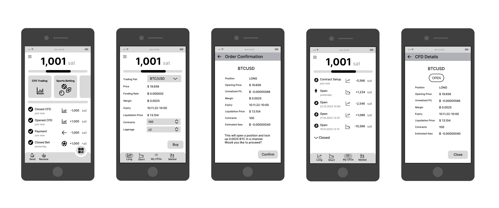

Hi Legends of Lightning Community!

We've spent the last week working on a design to bring non-custodial financial products to mobile. The first use case we've focused on is "non-perpetual" CFD trading.
If you are interested, we already have a working, perpetual solution for RPi and desktop available called [ItchySats](https://www.itchysats.network/).

Without further ado, here is the first user journey for creating a long position.

The journey starts after the user has already initialised her lightning wallet.
We analysed existing apps and designed onboarding screens for that, but you likely have already seen that in your wallet of choice.
Have a look at our [TenTenOne Figma Wireframes](https://www.figma.com/file/zUBJpQ0v8cx6DHivS10OeI/TenTenOneWireFrame) if you like to see more.

For this post we focus on the journey of the user opening a CFD position, starting from the wallet's dashboard:

1. **Select CFD Trading**: 10101's vision is to support multiple financial products based on our non-custodial principles. Although, it's not scope for this tournament we've already illustratively added how other products could be selected.

2. **Open a position**: At the bottom you can see different icons for navigation. The screen depicted on the second screenshot shows opening a long position. The screen looks similar when you choose to open a short position.

3. **Confirm your order**: Once you hit `Buy` you see a confirmation page that indicates the amount of funds that will be locked in a multisig on chain. Once confirmed you will see the list of your CFDs with the new position on top.

4. **View all your CFDs**: Here you can see all open or pending CFDs and can check how your positions are doing - do they bring a profit or loss? You can find historic CFDs under the collapsable closed section.

5. **Check CFD details**: If you want to see more details of your position you can click on a list item and jump to the details view, showing attributes and actions of the CFD. These attributes include e.g. the BTC price at the time of opening, how much profit or loss (P/L) you would make, if the position is closed now and the expiration date - at this date the CFD will expire (current reduced scope of non-perpetual CFDs). You can close the position at any time before the expiry time is reached by hitting the `Close` button.

That's it, we would love to hear your feedback on our user journey design. [Visit our Figma Board](https://www.figma.com/file/zUBJpQ0v8cx6DHivS10OeI/TenTenOneWireFrame) and leave your comments there (commenting requires Figma signin / free signup)!
